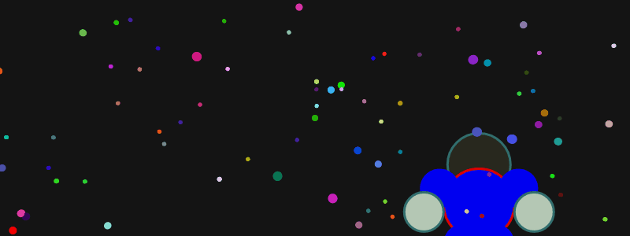

### 
| <><>=================================================<><> |

 

  
 

### 
| <><>=================================================<><> |

# | $\textcolor{RedOrange}{\text{Animacao Espacial}}$

Essa animação foi criada, como parte do projeto final da disciplina de **Sistemas Multimídias**, através da ferramenta **P5.js** (versão web do **Processing**) e ilustra, de forma criativa, como seria um passeio ou uma viagem espacial.

## | $\textcolor{Lime}{\text{Classes:}}$

 * [Estrelas](Classe_Star.js): Essa classe apresenta funções para desenhar e atualizar as estrelas.
 
 * [Personagem](Classe_Personagem.js): Essa classe apresenta funções para desenhar e movimentar um personagem humanóide.

## | $\textcolor{Yellow}{\text{Projeto:}}$
 
 * [Bibliotecas.](Bibliotecas)
 * [Arquivo da projeto.](index.html)
 * [Implementação da animação.](Sketch.js)
